# 001.HelloWorld

## 一、环境

* Eclipse Neon Release (4.6.0)
* Tomcat 9
* Jersey 2.23.2 [Link](https://jersey.java.net/download.html)

> Jersey JAX-RS 2.0 RI bundle bundle contains the JAX-RS 2.0 API jar, all the core Jersey module jars as well as all the required 3rd-party dependencies.

> Jersey 2.23.2 Examples bundle provides convenient access to the Jersey 2 examples for off-line browsing.

## 二、步骤

* Eclipse中创建一个 Dynamic Web Project并设置文件编码, 本例为“JerseyDemo”

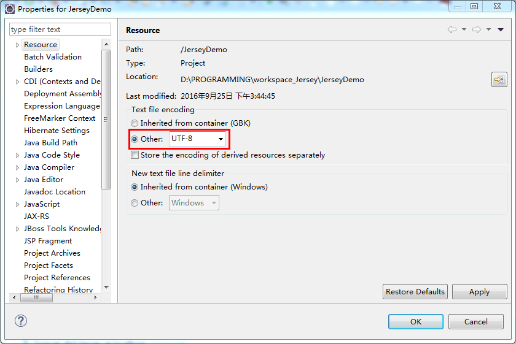

* 设置项目自动编译

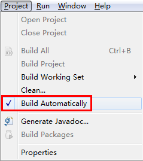

* 解压jaxrs-ri-2.23.2.zip，将api、ext、lib文件夹下的jar包都拷贝到项目的lib下

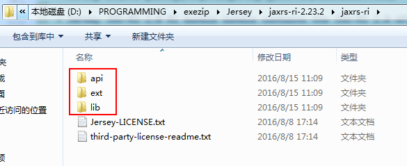

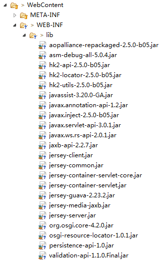

* 按照各人习惯建好包，本例为“com.jimmy.jersey.resources”

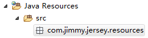

* 在resources包下建一个class“HelloResource”

	package com.jimmy.jersey.resources;
	
	import javax.ws.rs.GET;
	import javax.ws.rs.Path;
	import javax.ws.rs.PathParam;
	import javax.ws.rs.Produces;
	import javax.ws.rs.core.MediaType;
	
	@Path("/hello")
	public class HelloResource {
		
		private static final String CHARSET_UTF_8 = "charset=utf-8";
		
		@GET
		@Produces(MediaType.TEXT_PLAIN)
		public String sayHello() {
			return "Hello World!";
		}
	
		@GET
		@Path("{username}")
		@Produces(MediaType.TEXT_PLAIN + ";" + CHARSET_UTF_8)
		public String sayHelloToUTF8(@PathParam("username") String username) {
			return "Hello " + username;
		}		
	}

* 修改web.xml,添加基于Servlet的部署
	
	<?xml version="1.0" encoding="UTF-8"?>
	<web-app xmlns:xsi="http://www.w3.org/2001/XMLSchema-instance"
		xmlns="http://xmlns.jcp.org/xml/ns/javaee"
		xsi:schemaLocation="http://xmlns.jcp.org/xml/ns/javaee http://xmlns.jcp.org/xml/ns/javaee/web-app_3_1.xsd"
		id="WebApp_ID" version="3.1">
		<display-name>JerseyDemo</display-name>
		<servlet>
			<servlet-name>Jimmy REST Service</servlet-name>
			<servlet-class>org.glassfish.jersey.servlet.ServletContainer</servlet-class>
			<init-param>
				<param-name>jersey.config.server.provider.packages</param-name>
				<param-value>com.jimmy.jersey.resources</param-value>
			</init-param>
			<load-on-startup>1</load-on-startup>
		</servlet>
		<servlet-mapping>
			<servlet-name>Jimmy REST Service</servlet-name>
			<url-pattern>/rest/*</url-pattern>
		</servlet-mapping>
	</web-app>

* 在Eclipse上配置Tomcat Server

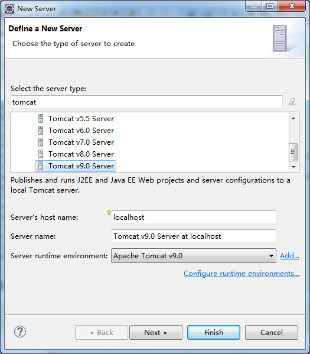

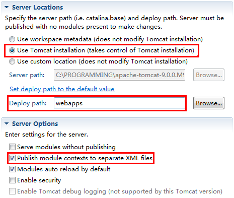

如果Server Locations是灰色无法编辑状态，需要Remove所有项目并Clean后方能操作

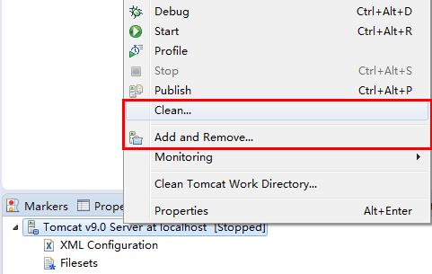

* 部署到Tomcat Server运行

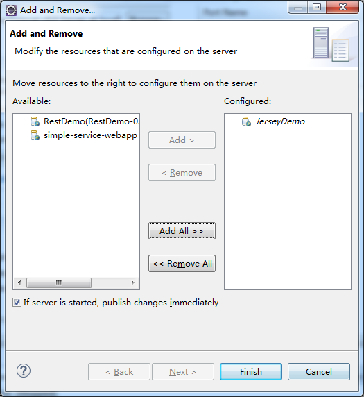

* 浏览器输入要访问的uri地址http://localhost:8080/JerseyDemo/rest/hello，输出Hello World!

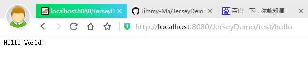

* 浏览器输入要访问的uri地址http://localhost:8080/JerseyDemo/rest/hello/Jimmy，输出Hello Jimmy

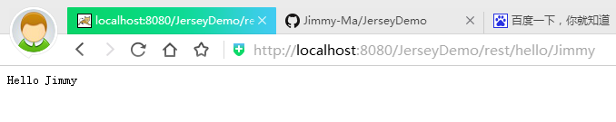

</ol>

